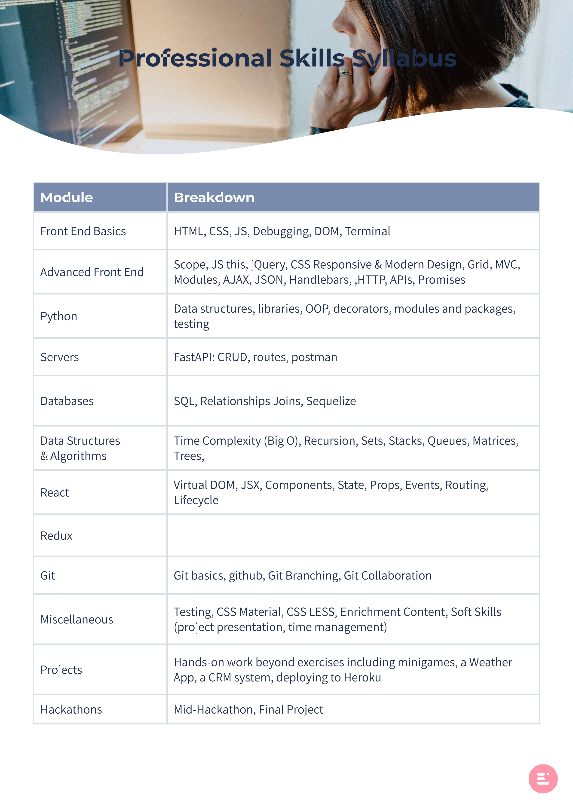
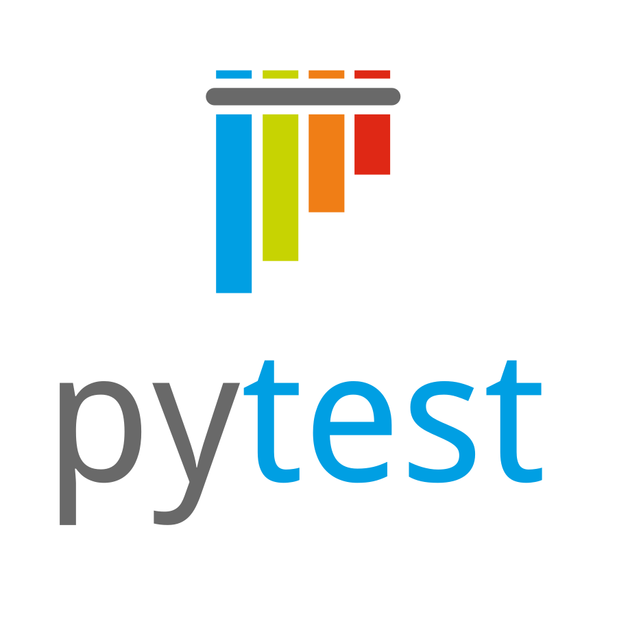

# U_Code full-stack bootcamp

Program official page: https://ucode-cybr.ac/

## About the bootcamp
A training program designed for copmuter science graduates, to become full-stack web developers at CyberArk R&D department. 

The bootcamp took 4 months, in which we learned new technologies every day, built individual projects, participated in hackathon, and created final project in groups. 

In addition, we learned how to work with agile methodologies, got code reviews by course staff and CyberArk mentors which focused on clean code, SOLID principles, REST API etc.

## Course Exercises
In this repo you can find all the exercises given along the course. The projects are stored in different repos.

## Sylabus

    

## Technologies and Tools
### Frontend:

    
    
    

    
    

    
    

    
    

### Backend:

    
    

    

    
    

### Tools:

    
    
    

